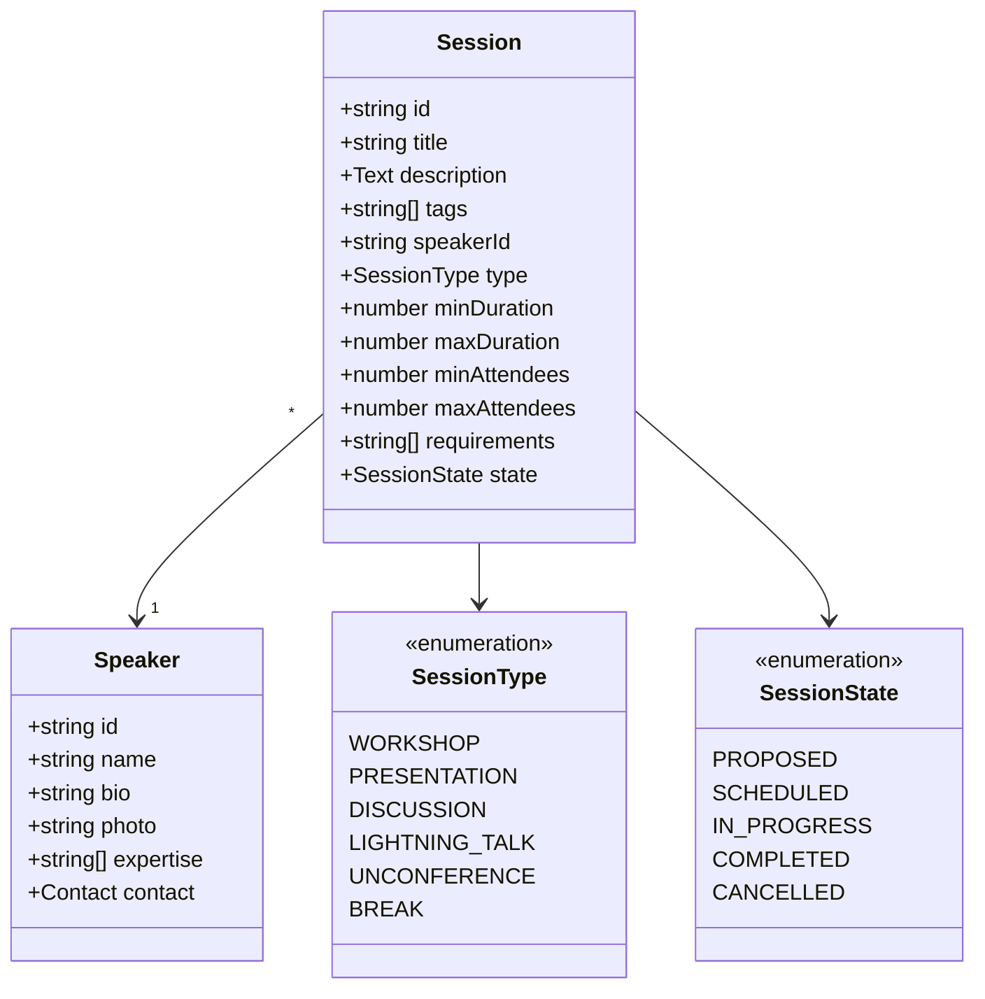
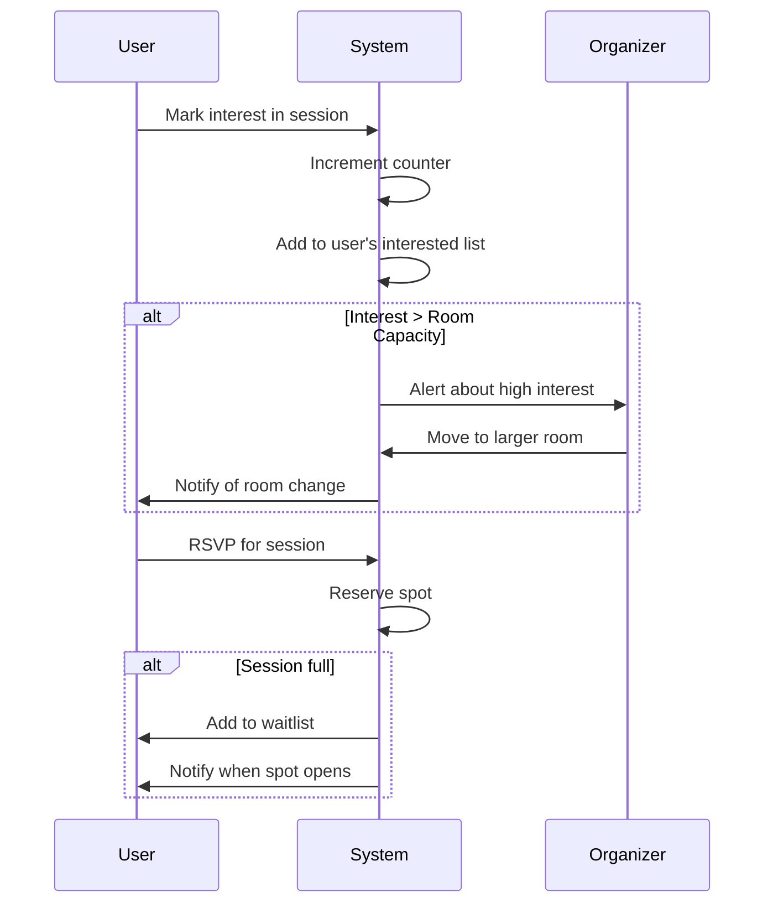
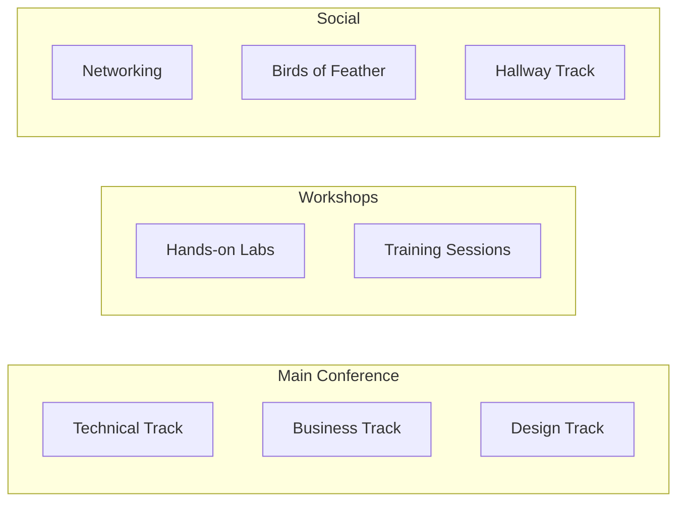
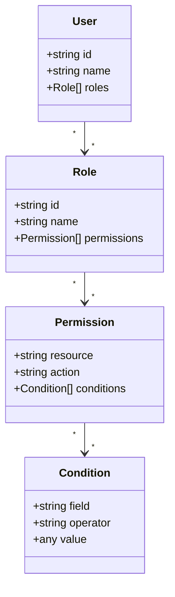
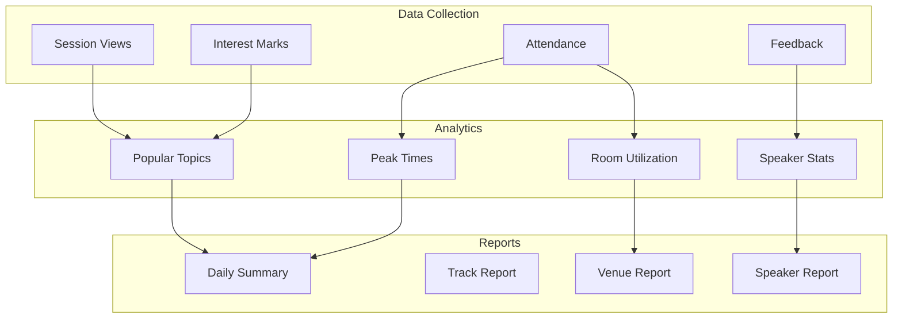

# Advanced Features Specification
## Extended Functionality Beyond Sticky Notes

## Introduction

This document describes advanced features that extend the basic sticky note board into a full-featured unconference scheduling system. These features add session management, user roles, capacity planning, and analytics while maintaining the simplicity of the core sticky note metaphor.

## Problem Statement

While sticky notes work well for basic scheduling, larger events need:
- **Capacity Management**: Knowing if a room is too small for interest level
- **Session Details**: Descriptions, prerequisites, speaker info
- **Attendee Coordination**: RSVP, waitlists, notifications
- **Multi-track Support**: Different session types (workshops, talks, discussions)
- **Access Control**: Only organizers should move certain sessions

## Feature Categories

### 1. Enhanced Session Management

#### Problem
Sticky notes are limited to short text. Real sessions need rich information.

#### Solution: Session Objects



#### Implementation

```typescript
interface EnhancedSession {
  id: string;
  title: Automerge.Text;
  description: Automerge.Text;
  tags: string[];
  speakerId: string;
  type: 'workshop' | 'presentation' | 'discussion' | 'lightning' | 'unconference';
  duration: {
    min: number;  // minutes
    max: number;
    preferred: number;
  };
  capacity: {
    min: number;
    max: number;
    preferred: number;
  };
  requirements: string[];  // "projector", "whiteboard", "power outlets"
  state: 'proposed' | 'scheduled' | 'in_progress' | 'completed' | 'cancelled';
  votes: Automerge.Counter;
  createdAt: number;
  updatedAt: number;
}

// Session proposal flow
function proposeSession(
  handle: DocHandle<ExtendedBoardDoc>,
  sessionData: Partial<EnhancedSession>
): string {
  const sessionId = crypto.randomUUID();
  
  handle.change(doc => {
    doc.sessions[sessionId] = {
      id: sessionId,
      title: new Automerge.Text(sessionData.title || 'Untitled Session'),
      description: new Automerge.Text(sessionData.description || ''),
      tags: sessionData.tags || [],
      speakerId: getCurrentUserId(),
      type: sessionData.type || 'unconference',
      duration: sessionData.duration || { min: 30, max: 90, preferred: 60 },
      capacity: sessionData.capacity || { min: 5, max: 50, preferred: 20 },
      requirements: sessionData.requirements || [],
      state: 'proposed',
      votes: new Automerge.Counter(),
      createdAt: Date.now(),
      updatedAt: Date.now()
    };
  });
  
  return sessionId;
}
```

### 2. Interest Tracking & Voting

#### Problem
Organizers need to know which sessions are popular to allocate appropriate rooms.

#### Solution: Multi-level Interest System



```typescript
interface InterestLevel {
  sessionId: string;
  userId: string;
  level: 'interested' | 'planning' | 'committed';
  timestamp: number;
}

interface Waitlist {
  sessionId: string;
  users: Array<{
    userId: string;
    joinedAt: number;
    notified: boolean;
  }>;
}

class InterestManager {
  markInterest(
    handle: DocHandle,
    sessionId: string,
    level: InterestLevel['level']
  ) {
    const userId = getCurrentUserId();
    const key = `${sessionId}-${userId}`;
    
    handle.change(doc => {
      // Update interest level
      doc.interests[key] = {
        sessionId,
        userId,
        level,
        timestamp: Date.now()
      };
      
      // Update session counter based on level
      const session = doc.sessions[sessionId];
      if (session) {
        // Weight by commitment level
        const weight = level === 'committed' ? 3 : 
                      level === 'planning' ? 2 : 1;
        session.interestScore.increment(weight);
      }
    });
  }
  
  calculateRoomFit(doc: BoardDoc, sessionId: string): 'too-small' | 'fits' | 'too-large' {
    const placement = doc.placements[sessionId];
    if (!placement) return 'fits';
    
    const room = doc.rooms[placement.roomId];
    const interests = Object.values(doc.interests)
      .filter(i => i.sessionId === sessionId);
    
    const committed = interests.filter(i => i.level === 'committed').length;
    const planning = interests.filter(i => i.level === 'planning').length;
    
    const estimated = committed + (planning * 0.5);
    
    if (estimated > room.capacity * 0.9) return 'too-small';
    if (estimated < room.capacity * 0.3) return 'too-large';
    return 'fits';
  }
}
```

### 3. Multi-Track Management

#### Problem
Large conferences have different types of activities happening simultaneously.

#### Solution: Track-based Organization



```typescript
interface Track {
  id: string;
  name: Automerge.Text;
  description: Automerge.Text;
  color: string;
  rooms: string[];  // Room IDs assigned to this track
  moderators: string[];  // User IDs who can manage this track
  rules: {
    allowOverlap: boolean;
    maxConcurrent: number;
    requiresApproval: boolean;
  };
}

interface RoomAssignment {
  roomId: string;
  trackId: string;
  timeRange: {
    start: number;
    end: number;
  };
}

// Track-aware scheduling
function scheduleInTrack(
  handle: DocHandle,
  sessionId: string,
  trackId: string,
  preferredTime?: number
) {
  handle.change(doc => {
    const track = doc.tracks[trackId];
    const session = doc.sessions[sessionId];
    
    if (!track || !session) return;
    
    // Find available slot in track's rooms
    const availableSlots = findTrackSlots(
      doc,
      track,
      session.duration.preferred
    );
    
    if (availableSlots.length === 0) {
      throw new Error('No available slots in track');
    }
    
    // Pick best slot (closest to preferred time)
    const bestSlot = preferredTime
      ? availableSlots.sort((a, b) => 
          Math.abs(a.time - preferredTime) - Math.abs(b.time - preferredTime)
        )[0]
      : availableSlots[0];
    
    // Place session
    doc.placements[sessionId] = {
      roomId: bestSlot.roomId,
      slotIndex: bestSlot.slotIndex,
      spanSlots: Math.ceil(session.duration.preferred / 15),
      trackId
    };
    
    session.state = 'scheduled';
  });
}
```

### 4. Permission & Role Management

#### Problem
Not everyone should be able to move or edit all sessions.

#### Solution: Capability-Based Access Control



```typescript
interface UserRole {
  userId: string;
  role: 'attendee' | 'speaker' | 'organizer' | 'admin';
  permissions: Set<string>;
  grantedBy: string;
  grantedAt: number;
}

interface SessionPermission {
  sessionId: string;
  userId: string;
  canEdit: boolean;
  canMove: boolean;
  canDelete: boolean;
}

class PermissionManager {
  canEditSession(doc: BoardDoc, userId: string, sessionId: string): boolean {
    const session = doc.sessions[sessionId];
    const user = doc.users[userId];
    
    if (!session || !user) return false;
    
    // Owner can always edit
    if (session.speakerId === userId) return true;
    
    // Check role-based permissions
    const userRole = doc.roles[userId];
    if (userRole?.role === 'organizer' || userRole?.role === 'admin') {
      return true;
    }
    
    // Check explicit permissions
    const permission = doc.permissions[`${sessionId}-${userId}`];
    return permission?.canEdit || false;
  }
  
  enforcePermission(
    handle: DocHandle,
    action: string,
    resourceId: string,
    callback: (doc: any) => void
  ) {
    const userId = getCurrentUserId();
    const doc = handle.docSync();
    
    if (!this.hasPermission(doc, userId, action, resourceId)) {
      throw new Error(`Unauthorized: Cannot ${action} on ${resourceId}`);
    }
    
    handle.change(callback);
  }
}
```

### 5. Scheduling Automation

#### Problem
Manually scheduling dozens of sessions is time-consuming and error-prone.

#### Solution: Constraint-Based Auto-Scheduler

```typescript
interface SchedulingConstraint {
  type: 'no-overlap' | 'requires-gap' | 'same-time' | 'different-time' | 'room-requirement';
  sessions: string[];
  params?: any;
}

interface SchedulingPreference {
  sessionId: string;
  preferredTimes: number[];
  preferredRooms: string[];
  weight: number;
}

class AutoScheduler {
  private constraints: SchedulingConstraint[] = [];
  private preferences: SchedulingPreference[] = [];
  
  addConstraint(constraint: SchedulingConstraint) {
    this.constraints.push(constraint);
  }
  
  addPreference(preference: SchedulingPreference) {
    this.preferences.push(preference);
  }
  
  async findOptimalSchedule(
    doc: BoardDoc,
    sessions: string[]
  ): Promise<Map<string, Placement>> {
    // Build constraint graph
    const graph = this.buildConstraintGraph(sessions);
    
    // Use simulated annealing or genetic algorithm
    let bestSchedule = new Map<string, Placement>();
    let bestScore = -Infinity;
    
    for (let iteration = 0; iteration < 1000; iteration++) {
      const schedule = this.generateRandomSchedule(doc, sessions);
      const score = this.evaluateSchedule(schedule, doc);
      
      if (score > bestScore) {
        bestScore = score;
        bestSchedule = schedule;
      }
      
      // Improve schedule through local search
      this.improveSchedule(schedule, doc);
    }
    
    return bestSchedule;
  }
  
  private evaluateSchedule(
    schedule: Map<string, Placement>,
    doc: BoardDoc
  ): number {
    let score = 0;
    
    // Check constraints (hard requirements)
    for (const constraint of this.constraints) {
      if (!this.satisfiesConstraint(schedule, constraint)) {
        return -Infinity; // Invalid schedule
      }
    }
    
    // Evaluate preferences (soft requirements)
    for (const pref of this.preferences) {
      const placement = schedule.get(pref.sessionId);
      if (!placement) continue;
      
      // Score based on time preference
      const timeScore = this.scoreTimePreference(placement, pref);
      
      // Score based on room preference  
      const roomScore = this.scoreRoomPreference(placement, pref);
      
      score += (timeScore + roomScore) * pref.weight;
    }
    
    // Penalize room changes for same speaker
    score -= this.calculateRoomChangePenalty(schedule, doc);
    
    // Bonus for balanced room utilization
    score += this.calculateUtilizationBonus(schedule, doc);
    
    return score;
  }
}
```

### 6. Analytics & Reporting

#### Problem
Organizers need insights into attendance patterns and session success.

#### Solution: Real-time Analytics Dashboard



```typescript
interface Analytics {
  sessions: {
    totalProposed: number;
    totalScheduled: number;
    averageInterest: number;
    topTags: Array<{tag: string; count: number}>;
  };
  
  attendance: {
    peakTime: number;
    averagePerSession: number;
    utilization: Map<string, number>; // roomId -> percentage
  };
  
  engagement: {
    totalVotes: number;
    totalComments: number;
    activeUsers: number;
  };
}

class AnalyticsEngine {
  generateReport(doc: BoardDoc): Analytics {
    const sessions = Object.values(doc.sessions);
    const interests = Object.values(doc.interests);
    
    // Aggregate tag popularity
    const tagCounts = new Map<string, number>();
    sessions.forEach(session => {
      session.tags.forEach(tag => {
        tagCounts.set(tag, (tagCounts.get(tag) || 0) + 1);
      });
    });
    
    // Calculate room utilization
    const utilization = new Map<string, number>();
    Object.values(doc.rooms).forEach(room => {
      const roomSessions = Object.entries(doc.placements)
        .filter(([_, p]) => p.roomId === room.id);
      
      const totalSlots = this.calculateTotalSlots(doc);
      const usedSlots = roomSessions.reduce((sum, [_, p]) => 
        sum + p.spanSlots, 0
      );
      
      utilization.set(room.id, (usedSlots / totalSlots) * 100);
    });
    
    return {
      sessions: {
        totalProposed: sessions.filter(s => s.state === 'proposed').length,
        totalScheduled: sessions.filter(s => s.state === 'scheduled').length,
        averageInterest: interests.length / sessions.length,
        topTags: Array.from(tagCounts.entries())
          .sort((a, b) => b[1] - a[1])
          .slice(0, 10)
          .map(([tag, count]) => ({tag, count}))
      },
      
      attendance: {
        peakTime: this.findPeakTime(doc),
        averagePerSession: this.calculateAverageAttendance(doc),
        utilization
      },
      
      engagement: {
        totalVotes: sessions.reduce((sum, s) => 
          sum + (s.votes?.value || 0), 0
        ),
        totalComments: Object.keys(doc.comments || {}).length,
        activeUsers: new Set(interests.map(i => i.userId)).size
      }
    };
  }
  
  exportToCSV(analytics: Analytics): string {
    const lines = [
      'Metric,Value',
      `Total Proposed Sessions,${analytics.sessions.totalProposed}`,
      `Total Scheduled Sessions,${analytics.sessions.totalScheduled}`,
      `Average Interest per Session,${analytics.sessions.averageInterest.toFixed(2)}`,
      `Total Votes,${analytics.engagement.totalVotes}`,
      `Total Comments,${analytics.engagement.totalComments}`,
      `Active Users,${analytics.engagement.activeUsers}`,
      '',
      'Top Tags,Count'
    ];
    
    analytics.sessions.topTags.forEach(({tag, count}) => {
      lines.push(`${tag},${count}`);
    });
    
    return lines.join('\n');
  }
}
```

### 7. Integration & Export

#### Problem
Event data needs to integrate with other tools (calendars, websites, apps).

#### Solution: Multiple Export Formats

```typescript
interface ExportFormat {
  toICS(): string;
  toJSON(): string;
  toHTML(): string;
  toMarkdown(): string;
}

class ScheduleExporter implements ExportFormat {
  constructor(private doc: BoardDoc) {}
  
  toICS(): string {
    const lines = [
      'BEGIN:VCALENDAR',
      'VERSION:2.0',
      'PRODID:-//Unconference//Schedule//EN'
    ];
    
    Object.entries(this.doc.placements).forEach(([sessionId, placement]) => {
      const session = this.doc.sessions[sessionId];
      const room = this.doc.rooms[placement.roomId];
      const slot = this.doc.timeSlots[placement.slotIndex];
      
      if (!session || !room || !slot) return;
      
      const startTime = new Date(slot.time);
      const endTime = new Date(
        slot.time + (placement.spanSlots * 15 * 60 * 1000)
      );
      
      lines.push(
        'BEGIN:VEVENT',
        `UID:${sessionId}@unconference`,
        `DTSTART:${this.formatICSDate(startTime)}`,
        `DTEND:${this.formatICSDate(endTime)}`,
        `SUMMARY:${session.title.toString()}`,
        `DESCRIPTION:${session.description.toString()}`,
        `LOCATION:${room.name.toString()}`,
        'END:VEVENT'
      );
    });
    
    lines.push('END:VCALENDAR');
    return lines.join('\r\n');
  }
  
  toJSON(): string {
    const schedule = Object.entries(this.doc.placements).map(
      ([sessionId, placement]) => {
        const session = this.doc.sessions[sessionId];
        const room = this.doc.rooms[placement.roomId];
        const slot = this.doc.timeSlots[placement.slotIndex];
        
        return {
          sessionId,
          title: session?.title.toString(),
          description: session?.description.toString(),
          room: room?.name.toString(),
          startTime: slot?.time,
          duration: placement.spanSlots * 15,
          speaker: this.doc.users[session?.speakerId]?.name.toString(),
          tags: session?.tags,
          interestCount: session?.interestScore?.value
        };
      }
    );
    
    return JSON.stringify(schedule, null, 2);
  }
  
  toHTML(): string {
    // Generate responsive HTML schedule
    return `
      <!DOCTYPE html>
      <html>
      <head>
        <title>Conference Schedule</title>
        <meta name="viewport" content="width=device-width, initial-scale=1">
        <style>
          /* Responsive grid styles */
        </style>
      </head>
      <body>
        ${this.renderHTMLSchedule()}
      </body>
      </html>
    `;
  }
  
  toMarkdown(): string {
    const lines = ['# Conference Schedule\n'];
    
    // Group by time slot
    const byTime = new Map<number, any[]>();
    
    Object.entries(this.doc.placements).forEach(([sessionId, placement]) => {
      const slot = this.doc.timeSlots[placement.slotIndex];
      if (!slot) return;
      
      const sessions = byTime.get(slot.time) || [];
      sessions.push({sessionId, placement});
      byTime.set(slot.time, sessions);
    });
    
    // Sort by time and output
    Array.from(byTime.entries())
      .sort((a, b) => a[0] - b[0])
      .forEach(([time, sessions]) => {
        lines.push(`\n## ${new Date(time).toLocaleTimeString()}\n`);
        
        sessions.forEach(({sessionId, placement}) => {
          const session = this.doc.sessions[sessionId];
          const room = this.doc.rooms[placement.roomId];
          
          lines.push(
            `### ${session?.title.toString()}`,
            `**Room:** ${room?.name.toString()}`,
            `**Duration:** ${placement.spanSlots * 15} minutes`,
            `\n${session?.description.toString()}\n`
          );
        });
      });
    
    return lines.join('\n');
  }
}
```

## Implementation Roadmap

### Phase 1: Core Enhancements (Week 1)
- Enhanced session objects
- Basic interest tracking
- Simple permission system

### Phase 2: Scheduling Tools (Week 2)
- Multi-track support
- Auto-scheduling algorithm
- Conflict detection improvements

### Phase 3: Analytics (Week 3)
- Data collection framework
- Basic reporting
- Export capabilities

### Phase 4: Integration (Week 4)
- Calendar export
- API endpoints
- Mobile app support

## Technical Considerations

### Performance
- Lazy load session details
- Paginate large session lists
- Cache analytics calculations
- Use Web Workers for heavy computations

### Scalability
- Split documents by day/track
- Implement document archiving
- Use CDN for static assets
- Horizontal scaling for sync servers

### Security
- Implement proper authentication
- Rate limit API endpoints
- Validate all user inputs
- Audit log for critical actions

## Conclusion

These advanced features transform the simple sticky note board into a comprehensive conference management system while maintaining the intuitive interface and real-time collaboration that makes the core product valuable.