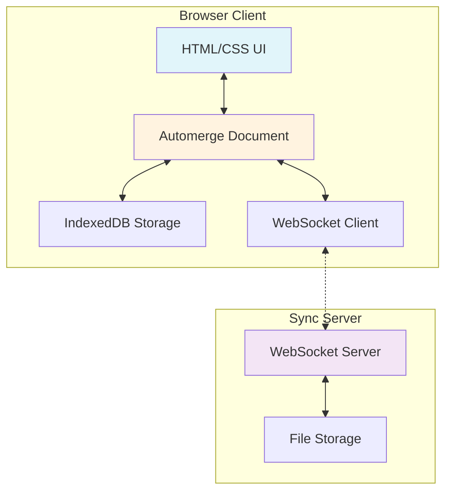
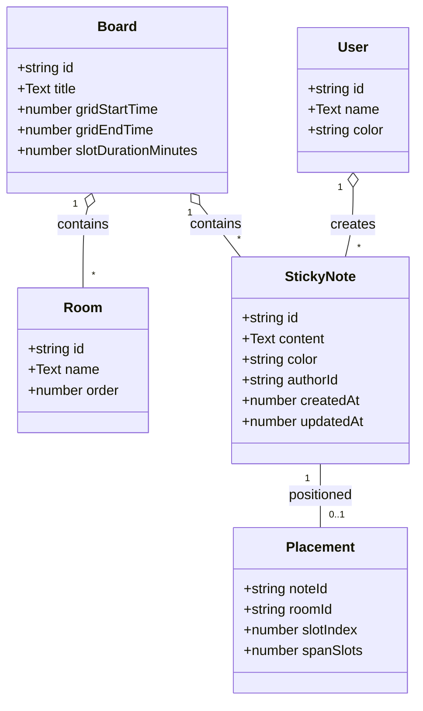
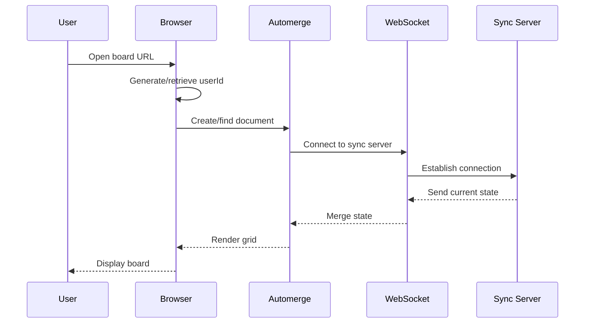
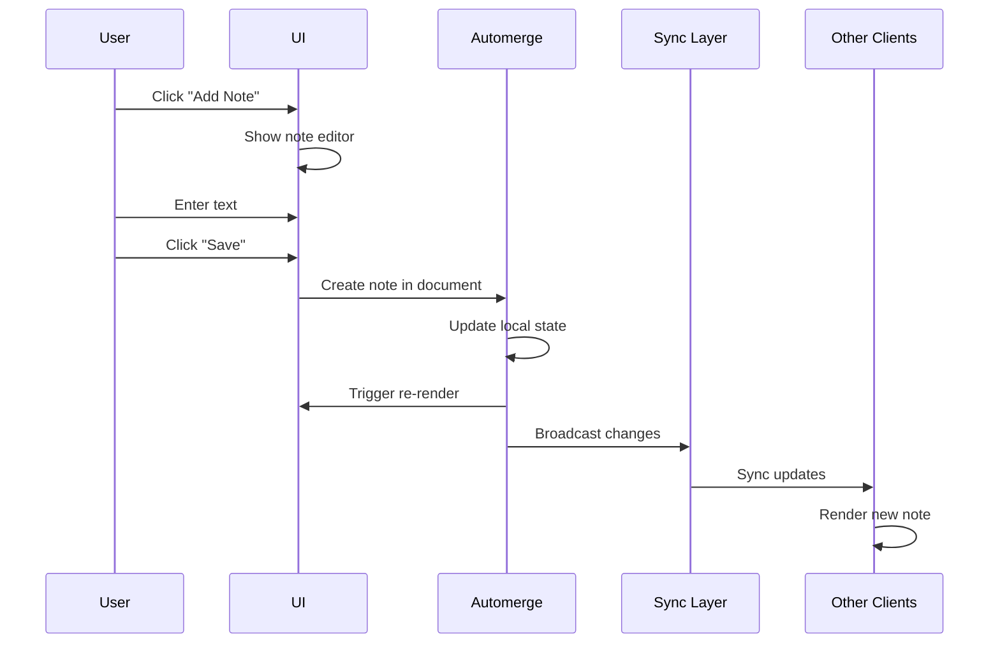
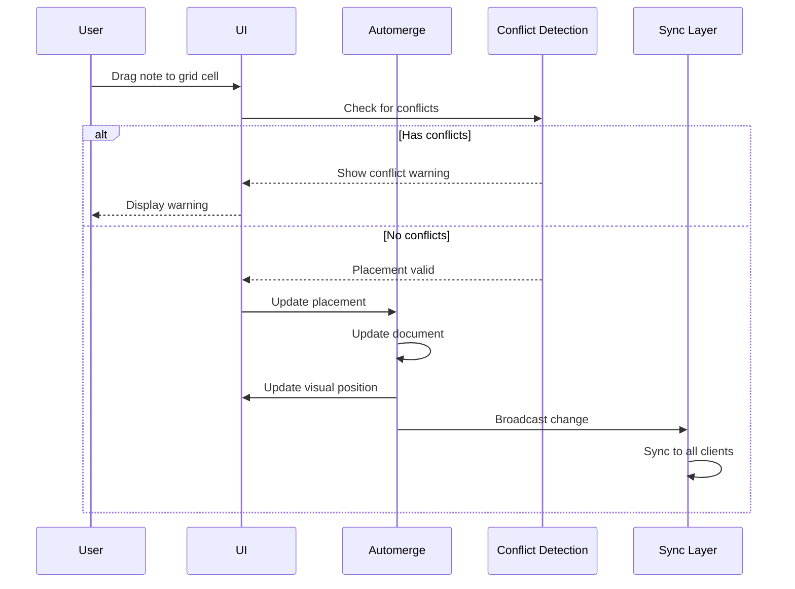
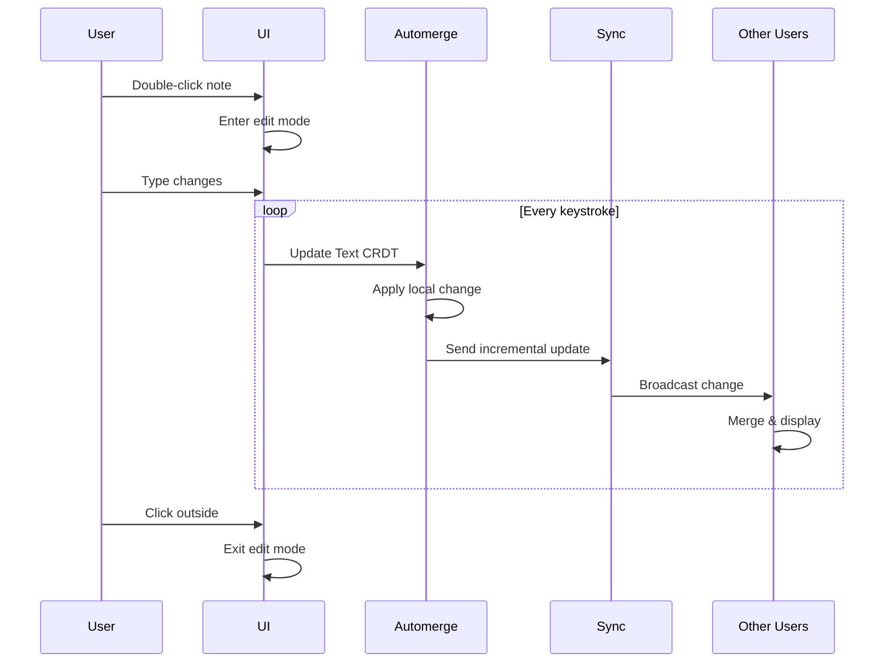

# Sticky Note Board MVP Specification
## Real-time Collaborative Scheduling with Automerge

## Introduction

This specification describes a minimal viable product (MVP) for an unconference scheduling system that operates like a digital sticky note board. Users can place text notes on a time/room grid, move them around, and see changes from other participants in real-time. The system uses Automerge CRDTs to ensure conflict-free collaboration without requiring a traditional backend.

## Problem Statement

### Current Pain Points
1. **Physical Limitations**: Traditional unconference scheduling uses physical sticky notes on walls, limiting remote participation
2. **Synchronization Issues**: Digital alternatives often suffer from conflicts when multiple organizers edit simultaneously  
3. **Complex Infrastructure**: Most solutions require servers, databases, and complex sync logic
4. **Lost Context**: Changes made by one person aren't immediately visible to others, causing double-bookings

### Solution Approach
Create a digital sticky note board that:
- Works like a physical wall of sticky notes
- Syncs automatically across all participants
- Handles concurrent edits without conflicts
- Requires minimal server infrastructure
- Works offline and syncs when reconnected

## Core Concept

Users see a grid where:
- **Columns** = Rooms/Tracks
- **Rows** = Time slots (15-minute increments)
- **Sticky Notes** = Simple text that can span multiple time slots

Each sticky note contains only:
- Text content (title/description)
- Color (for visual organization)
- Size (1-4 time slots)

## Architecture Overview



## Data Model



## Automerge Document Structure

```typescript
import * as Automerge from '@automerge/automerge';

type BoardDoc = {
  board: {
    id: string;
    title: Automerge.Text;
    gridStartTime: number;    // Unix timestamp
    gridEndTime: number;      
    slotDurationMinutes: number; // 15
  };
  
  rooms: Record<string, {
    id: string;
    name: Automerge.Text;
    order: number;
  }>;
  
  notes: Record<string, {
    id: string;
    content: Automerge.Text;
    color: string;  // hex color
    authorId: string;
    createdAt: number;
    updatedAt: number;
  }>;
  
  placements: Record<string, {  // noteId -> placement
    roomId: string;
    slotIndex: number;
    spanSlots: number;  // 1-4 (15-60 minutes)
  }>;
  
  users: Record<string, {
    id: string;
    name: Automerge.Text;
    cursorColor: string;
  }>;
};
```

## Key User Flows

### 1. Initialize Board



```typescript
async function initializeBoard(boardId?: string) {
  // 1. Setup user identity
  const userId = localStorage.getItem('userId') || crypto.randomUUID();
  localStorage.setItem('userId', userId);
  
  // 2. Initialize Automerge repo
  const repo = new Repo({
    storage: new IndexedDBStorageAdapter(),
    network: [new BrowserWebSocketClientAdapter('ws://localhost:3030')],
  });
  
  // 3. Get or create board document
  const docId = boardId || 'default-board';
  const handle = repo.find<BoardDoc>(docId);
  
  await handle.whenReady();
  
  // 4. Initialize if empty
  if (!handle.docSync()) {
    handle.change(doc => {
      doc.board = {
        id: docId,
        title: new Automerge.Text('Unconference Schedule'),
        gridStartTime: Date.now(),
        gridEndTime: Date.now() + (8 * 60 * 60 * 1000),
        slotDurationMinutes: 15
      };
      doc.rooms = {};
      doc.notes = {};
      doc.placements = {};
      doc.users = {};
      
      // Create default rooms
      createDefaultRooms(doc);
    });
  }
  
  // 5. Register current user
  handle.change(doc => {
    doc.users[userId] = {
      id: userId,
      name: new Automerge.Text('Anonymous'),
      cursorColor: generateRandomColor()
    };
  });
  
  return handle;
}
```

### 2. Create Sticky Note



```typescript
function createStickyNote(
  handle: DocHandle<BoardDoc>,
  content: string,
  color: string = '#ffeb3b'
): string {
  const noteId = crypto.randomUUID();
  const userId = getCurrentUserId();
  
  handle.change(doc => {
    doc.notes[noteId] = {
      id: noteId,
      content: new Automerge.Text(content),
      color,
      authorId: userId,
      createdAt: Date.now(),
      updatedAt: Date.now()
    };
  });
  
  return noteId;
}
```

### 3. Place Note on Grid



```typescript
function placeNote(
  handle: DocHandle<BoardDoc>,
  noteId: string,
  roomId: string,
  slotIndex: number,
  spanSlots: number = 1
): boolean {
  // Check for conflicts in current state
  const doc = handle.docSync();
  const conflicts = findConflicts(doc, roomId, slotIndex, spanSlots, noteId);
  
  if (conflicts.length > 0) {
    showConflictWarning(conflicts);
    return false;
  }
  
  // Place the note
  handle.change(doc => {
    doc.placements[noteId] = {
      roomId,
      slotIndex,
      spanSlots
    };
    
    // Update note timestamp
    if (doc.notes[noteId]) {
      doc.notes[noteId].updatedAt = Date.now();
    }
  });
  
  return true;
}

function findConflicts(
  doc: BoardDoc,
  roomId: string,
  startSlot: number,
  span: number,
  excludeNoteId?: string
): string[] {
  const endSlot = startSlot + span;
  const conflicts: string[] = [];
  
  for (const [noteId, placement] of Object.entries(doc.placements)) {
    if (noteId === excludeNoteId) continue;
    if (placement.roomId !== roomId) continue;
    
    const placementEnd = placement.slotIndex + placement.spanSlots;
    
    // Check for overlap
    if (!(endSlot <= placement.slotIndex || startSlot >= placementEnd)) {
      conflicts.push(noteId);
    }
  }
  
  return conflicts;
}
```

### 4. Edit Note Content



```typescript
function editNoteContent(
  handle: DocHandle<BoardDoc>,
  noteId: string,
  newContent: string
) {
  handle.change(doc => {
    const note = doc.notes[noteId];
    if (note) {
      // Clear existing content
      note.content.deleteAt(0, note.content.length);
      // Insert new content
      note.content.insertAt(0, ...newContent.split(''));
      note.updatedAt = Date.now();
    }
  });
}

// For real-time collaborative editing
function setupCollaborativeEditing(
  handle: DocHandle<BoardDoc>,
  noteId: string,
  textArea: HTMLTextAreaElement
) {
  let isLocalChange = false;
  
  // Handle local edits
  textArea.addEventListener('input', (e) => {
    isLocalChange = true;
    const newValue = textArea.value;
    
    handle.change(doc => {
      const note = doc.notes[noteId];
      if (note) {
        // Simple replace for MVP
        note.content.deleteAt(0, note.content.length);
        note.content.insertAt(0, ...newValue.split(''));
      }
    });
    
    isLocalChange = false;
  });
  
  // Handle remote changes
  handle.on('change', ({ doc }) => {
    if (!isLocalChange) {
      const note = doc.notes[noteId];
      if (note) {
        const newContent = note.content.toString();
        if (textArea.value !== newContent) {
          const selectionStart = textArea.selectionStart;
          const selectionEnd = textArea.selectionEnd;
          
          textArea.value = newContent;
          
          // Restore cursor position
          textArea.setSelectionRange(selectionStart, selectionEnd);
        }
      }
    }
  });
}
```

### 5. Move Note

```typescript
function moveNote(
  handle: DocHandle<BoardDoc>,
  noteId: string,
  newRoomId: string,
  newSlotIndex: number
) {
  handle.change(doc => {
    const placement = doc.placements[noteId];
    if (placement) {
      // Check conflicts at new position
      const conflicts = findConflicts(
        doc,
        newRoomId,
        newSlotIndex,
        placement.spanSlots,
        noteId
      );
      
      if (conflicts.length === 0) {
        placement.roomId = newRoomId;
        placement.slotIndex = newSlotIndex;
        
        // Update timestamp
        if (doc.notes[noteId]) {
          doc.notes[noteId].updatedAt = Date.now();
        }
      }
    }
  });
}
```

## UI Implementation

### Grid Rendering

```typescript
function renderGrid(doc: BoardDoc): HTMLElement {
  const grid = document.createElement('div');
  grid.className = 'schedule-grid';
  
  // Calculate time slots
  const slots = generateTimeSlots(
    doc.board.gridStartTime,
    doc.board.gridEndTime,
    doc.board.slotDurationMinutes
  );
  
  // Create header row with rooms
  const header = document.createElement('div');
  header.className = 'grid-header';
  
  // Time column header
  header.innerHTML = '<div class="corner-cell"></div>';
  
  // Room headers
  const sortedRooms = Object.values(doc.rooms).sort((a, b) => a.order - b.order);
  for (const room of sortedRooms) {
    const roomHeader = document.createElement('div');
    roomHeader.className = 'room-header';
    roomHeader.textContent = room.name.toString();
    roomHeader.dataset.roomId = room.id;
    header.appendChild(roomHeader);
  }
  
  grid.appendChild(header);
  
  // Create grid body with time slots and cells
  const body = document.createElement('div');
  body.className = 'grid-body';
  
  slots.forEach((slot, slotIndex) => {
    const row = document.createElement('div');
    row.className = 'grid-row';
    
    // Time label
    const timeLabel = document.createElement('div');
    timeLabel.className = 'time-label';
    timeLabel.textContent = formatTime(slot.time);
    row.appendChild(timeLabel);
    
    // Room cells
    for (const room of sortedRooms) {
      const cell = document.createElement('div');
      cell.className = 'grid-cell';
      cell.dataset.roomId = room.id;
      cell.dataset.slotIndex = slotIndex.toString();
      
      // Enable drop
      cell.addEventListener('dragover', handleDragOver);
      cell.addEventListener('drop', handleDrop);
      
      row.appendChild(cell);
    }
    
    body.appendChild(row);
  });
  
  grid.appendChild(body);
  
  // Place all notes
  for (const [noteId, placement] of Object.entries(doc.placements)) {
    const note = doc.notes[noteId];
    if (note) {
      placeNoteElement(grid, noteId, note, placement);
    }
  }
  
  return grid;
}
```

### Sticky Note Component

```typescript
function createNoteElement(
  noteId: string,
  note: BoardDoc['notes'][string]
): HTMLElement {
  const element = document.createElement('div');
  element.className = 'sticky-note';
  element.dataset.noteId = noteId;
  element.style.backgroundColor = note.color;
  
  // Content
  const content = document.createElement('div');
  content.className = 'note-content';
  content.textContent = note.content.toString();
  element.appendChild(content);
  
  // Author indicator
  const author = document.createElement('div');
  author.className = 'note-author';
  const user = getCurrentDoc().users[note.authorId];
  author.style.backgroundColor = user?.cursorColor || '#999';
  element.appendChild(author);
  
  // Make draggable
  element.draggable = true;
  element.addEventListener('dragstart', handleDragStart);
  
  // Make editable
  element.addEventListener('dblclick', () => enterEditMode(noteId));
  
  return element;
}
```

### CSS Styling

```css
.schedule-grid {
  display: grid;
  grid-template-rows: auto 1fr;
  height: 100vh;
  overflow: auto;
  background: #f5f5f5;
}

.grid-header {
  display: grid;
  grid-template-columns: 100px repeat(var(--room-count), 1fr);
  background: white;
  border-bottom: 2px solid #ddd;
  position: sticky;
  top: 0;
  z-index: 10;
}

.room-header {
  padding: 1rem;
  text-align: center;
  font-weight: bold;
  border-left: 1px solid #ddd;
}

.grid-body {
  display: grid;
  grid-template-rows: repeat(var(--slot-count), 60px);
}

.grid-row {
  display: grid;
  grid-template-columns: 100px repeat(var(--room-count), 1fr);
  border-bottom: 1px solid #e0e0e0;
}

.time-label {
  padding: 0.5rem;
  font-size: 0.875rem;
  color: #666;
  background: white;
  border-right: 1px solid #ddd;
}

.grid-cell {
  border-left: 1px solid #e0e0e0;
  position: relative;
  min-height: 60px;
}

.grid-cell.drag-over {
  background: rgba(33, 150, 243, 0.1);
}

.sticky-note {
  position: absolute;
  width: calc(100% - 8px);
  margin: 4px;
  padding: 8px;
  border-radius: 4px;
  box-shadow: 0 2px 4px rgba(0,0,0,0.1);
  cursor: move;
  transition: transform 0.2s;
  z-index: 1;
}

.sticky-note:hover {
  transform: scale(1.02);
  box-shadow: 0 4px 8px rgba(0,0,0,0.15);
  z-index: 2;
}

.sticky-note.dragging {
  opacity: 0.5;
}

.note-content {
  font-size: 0.875rem;
  line-height: 1.4;
  word-wrap: break-word;
  max-height: calc(100% - 20px);
  overflow: hidden;
}

.note-author {
  position: absolute;
  top: 4px;
  right: 4px;
  width: 8px;
  height: 8px;
  border-radius: 50%;
}

.note-editor {
  position: absolute;
  z-index: 100;
  background: white;
  border: 2px solid #2196f3;
  border-radius: 4px;
  padding: 8px;
  box-shadow: 0 4px 12px rgba(0,0,0,0.2);
}

.note-editor textarea {
  border: none;
  outline: none;
  resize: none;
  font-family: inherit;
  font-size: 0.875rem;
  width: 200px;
  height: 100px;
}
```

## Sync Server Implementation

```typescript
// sync-server.ts
import { WebSocketServer } from 'ws';
import { NodeWSServerAdapter } from '@automerge/automerge-repo-network-websocket';
import { Repo } from '@automerge/automerge-repo';
import { NodeFSStorageAdapter } from '@automerge/automerge-repo-storage-nodefs';

const PORT = process.env.PORT || 3030;
const DATA_DIR = process.env.DATA_DIR || './board-data';

// Create WebSocket server
const wss = new WebSocketServer({ port: PORT });

// Initialize Automerge repo with persistence
const repo = new Repo({
  network: [new NodeWSServerAdapter(wss)],
  storage: new NodeFSStorageAdapter(DATA_DIR),
});

console.log(`Sticky Note Board sync server running on ws://localhost:${PORT}`);
console.log(`Data persisted to: ${DATA_DIR}`);

// Graceful shutdown
process.on('SIGTERM', () => {
  wss.close(() => {
    console.log('Server closed');
    process.exit(0);
  });
});
```

## Deployment

### Docker Deployment

```dockerfile
# Dockerfile
FROM node:18-alpine
WORKDIR /app
COPY package*.json ./
RUN npm ci --only=production
COPY sync-server.js ./
EXPOSE 3030
CMD ["node", "sync-server.js"]
```

### Static Files

```nginx
# nginx.conf for static files
server {
  listen 80;
  root /usr/share/nginx/html;
  
  location / {
    try_files $uri $uri/ /index.html;
    
    # Cache static assets
    location ~* \.(js|css|png|jpg|jpeg|gif|ico|svg)$ {
      expires 1y;
      add_header Cache-Control "public, immutable";
    }
  }
  
  # WebSocket proxy to sync server
  location /sync {
    proxy_pass http://sync-server:3030;
    proxy_http_version 1.1;
    proxy_set_header Upgrade $http_upgrade;
    proxy_set_header Connection "upgrade";
  }
}
```

## Security Considerations

1. **No Authentication in MVP**: Any user can edit any note
2. **Rate Limiting**: Should be added to sync server in production
3. **Input Sanitization**: All text content must be escaped when rendering
4. **HTTPS/WSS**: Use TLS in production for secure connections
5. **Data Validation**: Limit note size, number of notes per user

## Performance Optimizations

1. **Virtualization**: Only render visible grid cells
2. **Debouncing**: Batch rapid edits before syncing
3. **Lazy Loading**: Load historical data on demand
4. **Document Splitting**: One document per event/day
5. **Compression**: Use compression for WebSocket messages

## Future Enhancements

See [advanced-features.md](./advanced-features.md) for:
- Session management with duration and capacity
- User authentication and permissions
- Interest tracking and voting
- Conflict resolution workflows
- Export to calendar formats
- Mobile app support